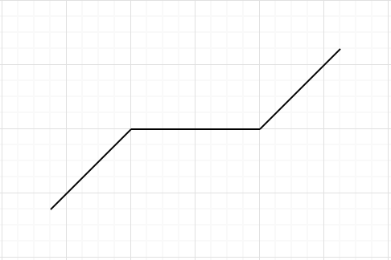

# Zelu

The Zelu activation function

 

The intuition behind this activation is that it benefits from the following

- Like RELU it is unbounded and therefore mitigate vanishing gradient problem
- Like Tanh it is zero mean'ed
- There is minimum threshold that the scores needs to bypass before activations start to propogate.      